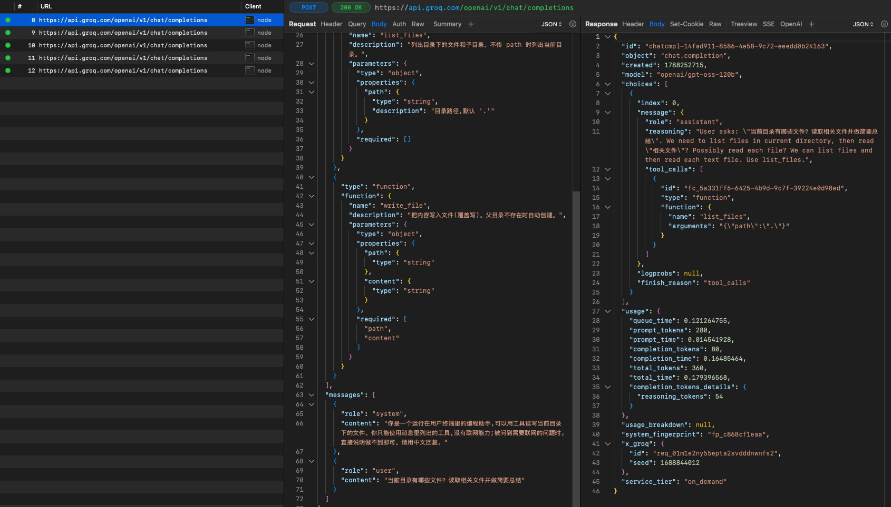
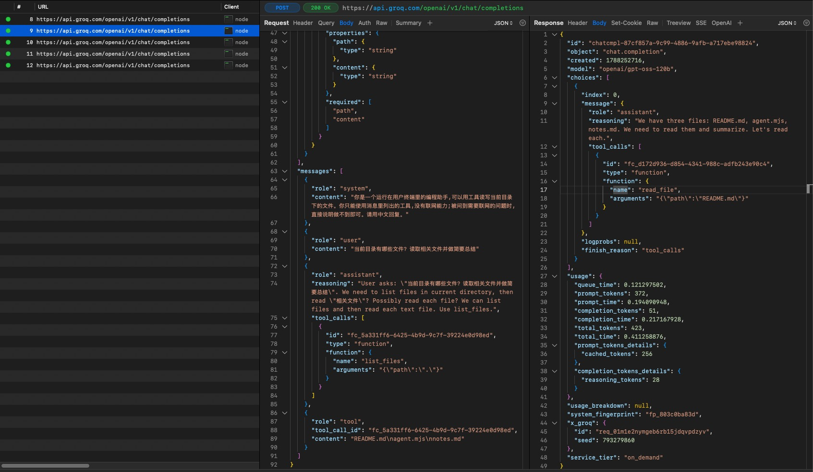

# 《从零手写Agent》EP4 十个我曾经答不上来的问题

## 目录与问题清单

### 一、协议与传输格式（Wire Format，EP0）

- Q1. 为什么 assistant 消息必须原样塞回？
- Q2. 并发工具调用时，tool_call_id 怎么对号入座？
- Q3. 工具报错和 API 报错，处理方式为什么完全不同？
- Q4. 为什么没定义的工具模型也能编出来？调用次数到底怎么算？

### 二、ReAct 与纯文本时代（EP1）

- Q5. 2022 年没有原生工具调用，ReAct 怎么让模型停下来？

### 三、自主循环与任务生命周期（EP2）

- Q6. 为什么要按 Issue 隔离会话？裁判权为什么留在宿主？

### 四、生产级运行宿主与控制工程（Harness，EP3）

- Q7. 为什么不能让模型自己判断路径合不合规？
- Q8. 为什么不能直接删消息？怎么保契约、瘦内容？
- Q9. Steer 和 FollowUp 差在哪？为什么必须只追加？

### 五、什么是 Harness（EP0 ～ EP3）

- Q10. 什么是 Harness？

---

平时用多了 Claude Code 和 Cursor，调过不少模型，但如果被追问“工具调用的底层数据流到底是怎样的”、“为什么模型不会直接编造工具结果”，很多地方其实容易含糊。亲手写完 EP0 到 EP3 的内核代码后，我把当初最核心的 10 个问题整理出来，用代码和实验现场逐一答题。

## 一、拆解底层传输格式（Wire Format）—— 模型到底怎么跟外部对话？（Q1 ～ Q4）

### 问题 1：为什么 assistant 消息必须原样塞回？

OpenAI 协议规范要求每条 `role: "tool"` 消息通过 `tool_call_id` 对应到前一条 `assistant.tool_calls` 里的某个调用，一批调用的结果补齐后才能继续。历史中如果少了这条 assistant 消息，会导致两类故障：
模型在上下文里看不到自己发起过调用，以为还没执行，于是反复调用；或者服务端、模板渲染器认为孤立的 tool 消息不合法，直接 400。下面两个实验一个对应一种。

实测（对比实验：注释掉 `ep0/agent.mjs:95` 中的 `messages.push(...)`）：

```js
// messages.push({ ...msg, content: msg.content ?? "" });   // ← agent.mjs:95 注释掉这行
```

**实验 A**：llama-3.3-70b-versatile，2026-07 实测。该模型 Groq 已于 2026-09 下线；同一个 llama 在 Cloudflare 上复跑，40 秒内写了 21 遍还在继续、一次 400 都没有，被我手动中止，见 EP0 笔记「换用新模型重测」。

在历史中缺少 `assistant` 消息时，Groq 并没有拦下这些带孤儿 tool 消息的请求。模型连续 3 次调用 `write_file` 写入同一个文件（因为在上下文里看不到自己已经发起过调用），直到第 4 次生成的格式发生轻微畸变，才触发服务端的工具校验错误（400，`tool_use_failed`，拒的是畸形输出，不是孤儿消息本身）：

```bash
> node ep0/agent.mjs
模型:llama-3.3-70b-versatile(Ctrl-C 退出)

你: 写一首词

[tool] write_file {"content":"月亮沉落，星光闪烁，夜色静谧，世界安睡。","path":"词.txt"}

[tool] write_file {"content":"寒蝉凄切\n\n露井寒，月挂枫林。烛龙蛇，银河垂垂。","path":"词.txt"}

[tool] write_file {"content":"落日照大江，江流浩浩然。","path":"词.txt"}

[error] API 400: {"error":{"message":"tool call validation failed: attempted to call tool 'write_file{\"content\": \"花好月圆人寿，世代共承欢乐。\", \"path\": \"词.txt\"}' which was not in request.tools","type":"invalid_request_error","code":"tool_use_failed","failed_generation":"\u003cfunction=write_file{\"content\": \"花好月圆人寿，世代共承欢乐。\", \"path\": \"词.txt\"}\u003e\u003c/function\u003e"}}
```

**实验 B**：gpt-oss-120b，模板渲染阶段直接拒绝。

在有模板渲染和前置格式校验的服务端上，孤立的 tool 消息在模板构建阶段就被拒绝，返回 400：

```bash
> node ep0/agent.mjs
模型:openai/gpt-oss-120b(Ctrl-C 退出)

你: 当前目录有哪些文件？

[tool] list_files {"path":"."}

[error] API 400: {"error":{"message":"failed to template request: failed to render tokenized output: failed to render tokens with harmony: HarmonyError: EncodingError: Message=render failed: Tools should have a name!","type":"invalid_request_error"}}
```

### 问题 2：并发工具调用时，tool_call_id 怎么对号入座？

一条 assistant 回复里可以同时带多个 tool_call（并行调用），每个调用都分配了一个唯一的 `tool_call_id`（如 `call_abc123`）。返回结果时，必须把这个 id 原样带回对应的 `role: "tool"` 消息，靠它严格配对。

实测：

````text
你: 当前目录有哪些文件？读取相关文件并做简要总结

[tool] list_files {"path":"."}

[tool] read_file {"path":"README.md"}

[tool] read_file {"path":"notes.md"}

[tool] read_file {"path":"agent.mjs"}

AI: **当前目录文件列表**

```
README.md
agent.mjs
notes.md
```

**文件内容简要总结**

（……省略……）

**总体概览**

- 该目录提供了一个最小化的本地 **agent** 示例，演示了 **LLM + tool call** 的完整闭环：模型只生成工具调用的描述，实际文件读写等操作完全在本地实现。
- 通过 `README.md` 可以快速上手；`notes.md` 解释了背后的原理和常见坑；`agent.mjs` 是可直接运行的完整代码。
````

**抓包截图中的报文配对细节**：

先说清楚这次抓包的形状：模型每轮只发了一个调用，抓包软件左侧能看到 #8 到 #12 五次串行请求，所以截图证明的是配对规则本身，不是并发。第一次响应（[截图](./20260901165731_first_request.jpg)）里，`assistant` 消息带一个 `tool_calls` 数组，里面的调用有自己的 `id`；第二次请求（[截图](./20260901165731_second_request.jpg)）的 `messages` 里，`role: "tool"` 消息带着同一个 `tool_call_id` 回去。并发时只是这个数组里多几个元素，每个结果各自带自己的 id 回填，规则一样。

终端日志只打印了工具名和参数，但底层靠的就是这些 `call_xxx` 单号：响应里发出来，下一次请求里带回去，几个工具并发、乱序执行也不会张冠李戴。




### 问题 3：工具报错和 API 报错，处理方式为什么完全不同？

**内层 catch 捕获的错误（工具执行报错）**：`runTurn` 里包着 `tool.run` 的 try/catch 兜住，把错误文本当普通 tool 消息塞回。OpenAI 格式没有单独的 `is_error` 标志位（Anthropic 格式有 `is_error: true`），模型靠阅读文本语义决定下一步是重试、换路径还是认错。工具失败是正常的数据反馈，喂给模型，会话保持连贯。

**外层 catch 捕获的错误（API 400 / 网络报错）**：它也是在内层循环里发生的，`callModel` 抛出来，但 `runTurn` 里没有捕获它，一路抛到 REPL 那层包着整轮 `runTurn` 的 catch。到这里这轮对话已经进行不下去，而且没法把错误“告诉模型”——告诉它恰恰需要一次成功的 API 调用，而失败的正是 API 调用。唯一干净的出路是当这轮没发生过：单行 `messages.length = mark` 整轮回滚。否则半截孤儿消息会污染上下文，后续请求直接报错失败。API 失败是事务失败。回滚的只是消息历史，这轮已经落盘的文件不会跟着撤销，重试就可能把写操作再跑一遍，EP3 的 `replay` 标注正是为了标记此类非幂等操作而设立。

### 问题 4：为什么没定义的工具模型也能编出来？调用次数到底怎么算？

工具调用不是 RPC，只是模型在预训练或微调里学会了按特定 JSON/XML 语法输出文本。真正的执行永远在宿主。

最直接的证据是 EP0 中的实测记录：删掉系统提示词里“没有联网能力”的约束后，用 `llama-3.3-70b-versatile` 问天气，模型凭空编出了一个从未定义过的 `brave_search` 调用，Groq 以 400 拒绝，`failed_generation` 字段完整记录了那段格式标准的调用文本。而把约束加回去、换成 `gpt-oss-120b` 再问，它老实承认做不到。注意这两次提示词不一样，它说明的是“约束声明有没有”决定了模型是老实回答还是编工具，不是两个模型谁更老实：

```bash
node --env-file=../.env agent.mjs
模型:openai/gpt-oss-120b(Ctrl-C 退出)

你: 今天天气如何？

AI: 抱歉，我无法获取实时天气信息。您可以查看本地天气预报或使用具有网络功能的应用来获取今天的天气情况。
```

用户在终端交互一轮，底层至少要发一次请求：直接回答就发一次，每执行完一批工具再发一次。模型一次返回多个并行工具调用时，宿主在本地 for 循环里把这批全跑完，所有 `role: "tool"` 消息一起塞进历史，再发下一次请求，所以一批并发工具只多 1 次调用。循环什么时候退出：某次回复里不再有工具调用（EP0 代码里判断 `!msg.tool_calls?.length`，对应 `finish_reason` 为 `"stop"`），模型输出纯文本，这轮就结束。

实测调用计数验证（2026-07，基于 `llama-3.3-70b-versatile`，临时在 `callModel` 处加了计数打印；2026-09 在 gpt-oss-120b 上同样的提问是 1 次，它直接把词写在回复里不落盘，改问“存到文件并确认”才变成 4 次）：

```bash
> node ep0/agent.mjs
模型:llama-3.3-70b-versatile(Ctrl-C 退出)

你: 写一首词，并检查格式正确

[call model api count] 1

[tool] write_file {"content":"江南佳丽地，水驿落花洲。花满渚，柳拂河，春风已无处。江南忆，最忆是，江南。","path":"ci.txt"}

[tool] read_file {"path":"ci.txt"}

[call model api count] 2

AI: 您的词已经成功写入文件 ci.txt 中，并且内容如下：江南佳丽地，水驿落花洲。花满渚，柳拂河，春风已无处。江南忆，最忆是，江南。格式似乎正确，无误。
```

## 二、ReAct 与纯文本时代（Q5）

### 问题 5：没有原生工具调用，ReAct 怎么让模型停下来？

2022 年 ReAct 论文（Yao et al., 2022）出来时，主流模型只有文本进、文本出的补全接口，没有函数调用协议（OpenAI 2023 年 6 月才推出）。那怎么让模型输出 `Thought` 和 `Action` 之后停下来，而不是把 `Observation` 也自己编出来？靠请求里的停止序列 `stop: ["\nObservation:"]`：模型刚要生成 `\nObservation:` 就被服务端掐断，控制权回到宿主；宿主本地执行完工具，把真实结果追加进提示词，再发下一轮。

在新模型对比测试中：gpt-oss-120b 与 qwen3.8 即使缺少 stop 参数也会在 Action Input 后自行暂停；而 llama-3.3-70b 仍会自行模拟后续的所有观察与回答（见 EP1 笔记「新模型重测」）。stop 机制虽从唯一的截断手段转变为兜底保障，但控制权仍必须牢牢保留在宿主手中。

## 三、自主任务队列 —— 批量跑任务的核心设计（Q6）

### 问题 6：为什么要按 Issue 隔离会话？裁判权为什么留在宿主？

从交互式对话走向无人值守的任务队列，有两个决定必须先做。

第一个是按任务隔离会话。上一个任务的修复代码、试错过程和错误堆栈留在历史里，会干扰模型对下一个任务的判断；不隔离，每多修一个 bug，请求历史就厚一层，几轮就撞 TPM；隔离之后，一个任务卡死也不连累后面的，下一个任务照样从干净状态开始。

第二个是裁判权留在宿主，不给 Agent 传 bash。实测若开放 `bash` 工具，模型面对陌生代码库时倾向于执行 `ls -R` 或全局 `grep`，导致 `node_modules` 等海量内容被直接载入上下文引发 413 报错。更重要的是控制权划分：Agent 负责改代码，“改对了没有”由宿主主循环跑 `node target/app.ts` 来判，只认硬指标（FAIL 行数比修之前少没少），不让模型既当运动员又当裁判。

## 四、迈向生产运行宿主（Harness）—— 从玩具到工程护栏（Q7 ～ Q9）

### 问题 7：为什么不能让模型自己判断路径合不合规？

若模型传入 `../../etc/passwd` 等越界路径，缺少防御的实现将直接导致目录穿越与非法读取。模型生成的参数属于不受信的外部输入，既可能受到提示词注入的操纵，也可能源于模型幻觉。合规性验证不能寄托于模型自身，必须由宿主在执行工具前通过 `resolveSafePath` 完成路径规范化与沙箱越界拦截。

### 问题 8：为什么不能直接删消息？怎么保契约、瘦内容？

直接 splice 删旧消息会拆散 `assistant.tool_calls` 和 `tool` 的配对，下一次请求 400。修剪的做法是保留 `role` 和 `tool_call_id` 骨架，只把早期历史里超过阈值（比如 >80 字符）的 tool content 换成占位符。结构对服务端还是合法的，长工具输出占的上下文没了。

### 问题 9：Steer 和 FollowUp 差在哪？为什么必须只追加？

- **中途插话（Steer）** 在每个 Turn 开始前的检查点（Checkpoint）抢占注入；**顺手接力（FollowUp）** 要等模型停下来、主任务全部完成后才消费。两者的触发时机和优先级完全不同。
- 为什么两者都只追加到历史尾部、不原地改写？因为服务端的 KV Cache 是按历史前缀建的，前缀一改就全部失效，Attention 要重算，首字延迟变长，缓存计费的折扣也没了。

上下文修剪（Pruning）是这条规则唯一的例外：它原地改写旧历史，主动放弃一次缓存，换后面每一轮更小的请求，所以只在超预算时做。

## 五、什么是 Harness（Q10）

### 问题 10：什么是 Harness？

从 EP0 的 136 行极简循环到 EP3 的多护栏系统，贯穿始终的 Runtime / Harness 到底是什么？

EP0 刚起步时，Runtime 只是包在模型调用外面的一圈闭环：发请求、跑工具、把消息塞回历史。往后每一课，这层外壳都因为真实的工程需求长出新东西。EP0 靠 Wire Format 契约驱动本地工具分发；EP1 没有原生协议，靠提示词格式约定和 `stop` 序列把控制权收回宿主；EP2 跑批量任务，多了会话隔离、宿主裁判权和限流重试；EP3 上生产，补了路径沙箱、输出截断、历史修剪和基于检查点的只追加调度。

走完这一趟，Harness 可以用一行写出来：

**Agent = LLM（文本生成器）+ Wire Format（对话协议）+ Harness（宿主控制工程）**

验证代码仅是表象，核心价值在于解构了 Agent 运行时的黑盒机制。后续审视各类框架与生产级工具时，其底层的调度与安全骨架就清晰可见。

---

代码：[agent-from-scratch/ep4](https://github.com/zjlgdx/agent-from-scratch/tree/main/ep4)（[quiz.mjs](https://github.com/zjlgdx/agent-from-scratch/blob/main/ep4/quiz.mjs)，零依赖的自测台，十道题和本文一一对应）；错题本在仓库根目录 [questions.md](https://github.com/zjlgdx/agent-from-scratch/blob/main/questions.md)。

运行：

```sh
cd ep4
node quiz.mjs
```
